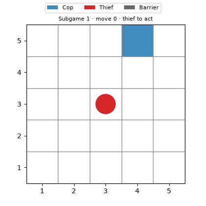
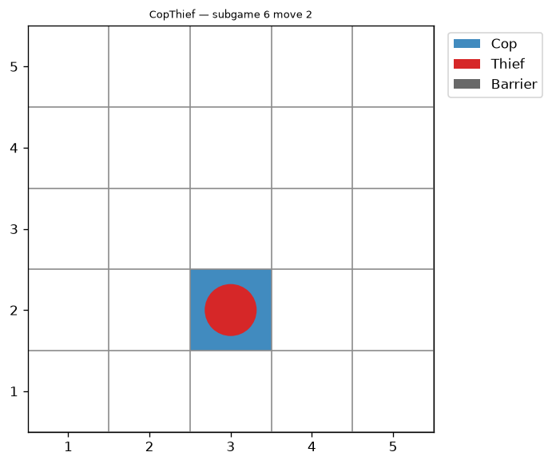
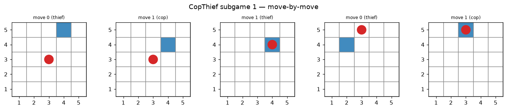
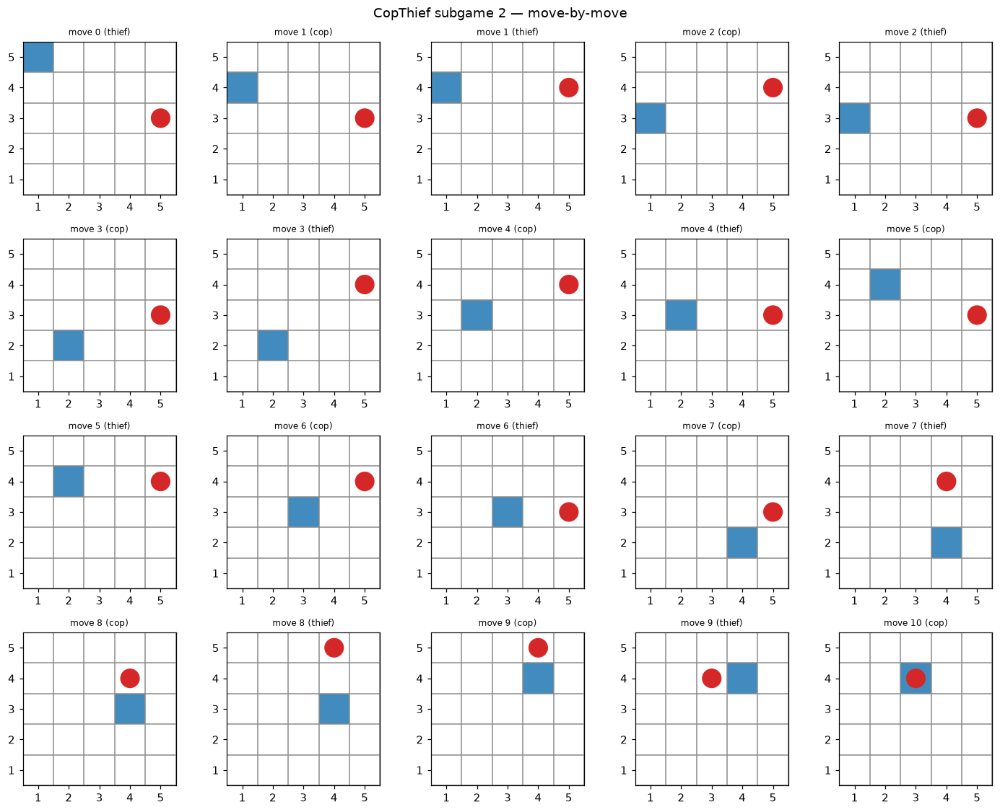
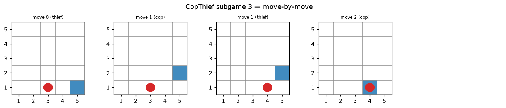
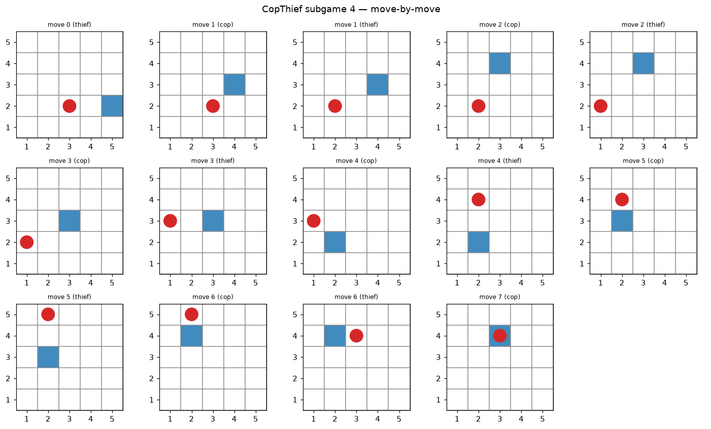
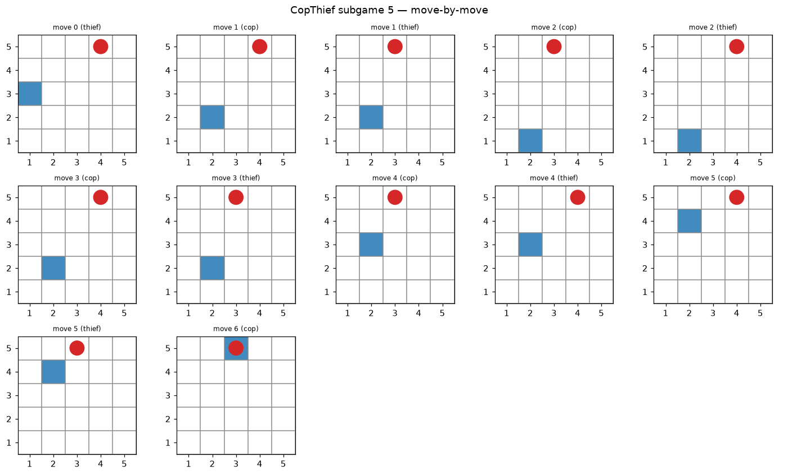
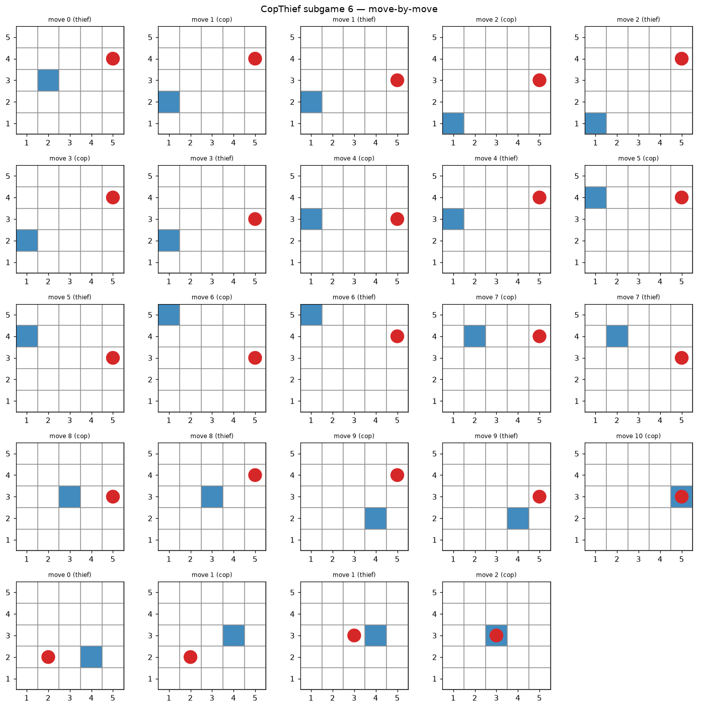

# CopThief — Dual AI Agents Pursuit Game over MCP Servers

> Course exercise 6 ("Orchestration of AI Agents", University of Haifa · Dr. Yoram Segal).
> Two autonomous AI agents — a **Cop** and a **Thief** — negotiate in free natural
> language and play a grid pursuit game. Each agent runs as its own **MCP server**
> (FastMCP) over HTTP; an MCP-client **orchestrator** owns the LLM and drives the match.

The headline grading criterion (per the lecture and PDF §3) is **a working end-to-end
pipeline**: two AI agents that set up a protocol by themselves and play. Strategy is
secondary. **This README doubles as the assignment's scientific report (PDF §11).**

---

## 1. Abstract

CopThief is a complete end-to-end pipeline in which two **autonomous AI agents** — a
**Cop** and a **Thief** — negotiate a protocol in **free natural language** and play a
turn-based pursuit game on a grid. Each agent runs as its own **MCP server** (FastMCP)
over HTTP; an **MCP client / orchestrator** owns the LLM, drives the dialogue, and acts
as the authoritative referee. The system runs fully locally (Level 1), is cloud-deployable
(Level 2), and supports inter-group competition (Level 3).

### 1.1 Extensions beyond the assignment PDF

The PDF mandates a working MCP pipeline and free-language play; we added the following
**original** work (for excellence-tier grading — extensions, not replacements):

| Extension | Why |
|-----------|-----|
| **DecPOMDP partial observation** (`vision_radius`, conditional disclosure) | Makes the pursuit genuinely partially observable; agents negotiate radius in inter-group play |
| **Deception + counter-intelligence** | Thief mirror-decoy lies; cop verifies once then ignores a proven liar |
| **Blind hunt / evasion** | Cop sweeps after last-seen; thief flees to open cells — competent play under hidden rival |
| **Board-size sensitivity study** | Notebook + table showing balance emerges on larger boards (self-game stays 5×5) |
| **Additive `interop/` adapter** | Level 3 without touching §5.2 core: `deliver_message`/`inbox`, commit-reveal audit, `SG:<index>` framing, two-phase report hash |
| **Collaborative bonus re-freeze** | With ImreEyal: 5×5→8×8, round-cap tuning (12/15→7) to break structural ties while keeping §12.2 scoring |
| **Named Cloudflare tunnel + ngrok post-mortem** | Reliable public MCP; documented why free ngrok failed mid-match (`docs/archive/ngrok.md`) |
| **Agent strategy skills** | `.claude/skills/` — cop/thief/protocol guides for consistent LLM behaviour |
| **Measured cost ledger** | [`docs/COST.md`](docs/COST.md): CLI $0, API ~$0.15/6 games (Opus 4.8), Gmail free |
| **Animated real-time GUI** | `selfplay --animate` live matplotlib window + `replay --save-gif` → `assets/demo_animation.gif` (headless-safe) |
| **Submission self-check gate** | `scripts/check_submission.py` maps every rubric item to an automated PASS/FAIL check |
| **Depth-1 minimax strategy** | `strategy/lookahead.py` acts against the opponent's best reply — strongest of the four policies (the default) |
| **Strategy arena** | `scripts/strategy_arena.py` quantifies policy strength head-to-head (win-rate matrix), the evidence behind the default |

## 2. Problem framing — a DecPOMDP

The pursuit is a **Decentralized, Partially Observable Markov Decision Process**, formally
`⟨ n, S, {Aᵢ}, P, R, {Ωᵢ}, O, γ ⟩`:

| Symbol | Meaning in CopThief |
|--------|---------------------|
| `n` | 2 agents — cop and thief |
| `S` | board state: both positions + the set of barrier cells |
| `{Aᵢ}` | per-agent actions: move in 8 directions, `STAY`, or (cop only) place a barrier |
| `P` | deterministic transition (referee applies a legal move; illegal → no-op) |
| `R` | the reward/score table (Section 3) |
| `{Ωᵢ}, O` | each agent observes only its own cell + the rival's *messages*; the rival's exact cell is revealed **only within a Chebyshev `vision_radius`** |
| `γ` | discount (conceptual; play is finite-horizon at 25 moves; used by optional Q-learning) |

Partial observability is the crux: beyond the vision radius an agent acts on a **belief**
formed from the opponent's free-text messages — which may be vague, stale, or **deceptive**.

## 3. Game rules, grid and scoring

- **Grid:** configurable (default **5×5**; supports 2×2…N×N for staged sanity checks),
  origin configurable, 8-directional movement.
- **Subgame:** ≤ 25 moves, turn-based, **thief moves first**. Cop wins by landing on the
  thief's cell; thief wins by surviving 25 moves. Cop may place ≤ 5 barriers; entering a
  barrier is illegal (the thief is caught if it does).
- **Game:** 6 subgames played in sequence; results aggregated.

| Outcome | Cop | Thief |
|---------|-----|-------|
| Cop wins | 20 | 5 |
| Thief wins | 5 | 10 |

Max per team in inter-group play = 90 (3×20 + 3×10); min = 30. Bonus: higher total → 10,
lower → 7, exact tie → 5 (averaged across series).

## 4. System architecture

Two views of the same system — **runtime flow** (what happens during a match) and **code
layering** (how the repo is organised).

### 4.1 Runtime flow — match play (PDF §5.2)

During a game the **orchestrator is the MCP client**: it runs both agent personas (each with
its own LLM dialogue), decides moves via strategy, verbalises them, and calls the remote
servers over HTTP. The servers are dumb tool hosts — no LLM inside.

```
            ┌──────────────────────── MCP client / orchestrator ─────────────────────────┐
            │  owns the LLM (per PDF §5.2)  ·  runs each agent persona  ·  referee+audit   │
            │   Agent(cop)  ── decide → verbalise → parse ──  Agent(thief)                 │
            └──────────┬──────────────────────────────────────────────┬──────────────────┘
                       │ MCP-over-HTTP (Bearer token)                  │
              ┌────────▼────────┐                            ┌─────────▼────────┐
              │ Cop MCP server  │  pure tools:               │ Thief MCP server │
              │ (FastMCP)       │  reset/observe/move/...     │ (FastMCP)        │
              └─────────────────┘                            └──────────────────┘
                                 deliver_message · inbox (inter-group only)
```

In **self-play** both URLs usually point at the same `serve-combined` process
(`/cop/mcp` + `/thief/mcp` on one port). In **inter-group** play each team hosts its
own pair of endpoints; the peer loop calls the opponent's `deliver_message` and polls its own
`inbox()`.

### 4.2 Code layering — SDK entry point

All CLI/GUI/tests go through **`CopThiefSDK`**; the orchestrator owns the LLM and referee
logic; MCP servers stay thin.

```
External (CLI / GUI / tests)
        │
        ▼
   CopThiefSDK (single entry point)
        │
        ▼
  Orchestrator = MCP CLIENT  ──owns──►  LLM (Claude / Ollama / API / mock)
   • builds observations, decides (strategy), verbalises (LLM)
   • authoritative referee (validates moves, detects capture)
   • writes the state-by-state audit log
        │  HTTP + Bearer token
        ├───────────────► Cop  MCP server  (FastMCP) — PURE TOOLS, no LLM
        └───────────────► Thief MCP server (FastMCP) — PURE TOOLS, no LLM
                          tools: reset, observe, move, place_barrier, note,
                                 deliver_message, inbox
```

**Component layout (`src/copthief/`):** `domain/` (board, rules, scoring, subgame state
machine) · `strategy/` (lookahead, adaptive, heuristic, tabular Q-learning) · `llm/` (provider
abstraction) · `agents/` (FastMCP servers + pure-tool session) · `orchestrator/`
(dialogue, negotiation, match runner, MCP client) · `interop/` (peer adapter for Level 3) ·
`reporting/` (JSON + Gmail) · `shared/` (config, audit logger, gatekeeper, version) ·
`gui/` · `sdk/`.

### 4.3 Cross-cutting concerns

- **LLM lives in the client, not the servers** (PDF §5.2): the orchestrator runs a separate
  LLM *persona* per agent inside the client. HTTP transport is used **even locally**, to
  prepare for the cloud step.
- **Security**: transport-level **bearer-token** auth on every call (revoke by rotating
  the token; wrong/absent token → 401). Secrets only via environment / `.env`.
- **Reliability**: all external LLM/Gmail calls route through an **API gatekeeper**
  (per-minute + per-hour rate-limit, retry) and a **token-usage meter** (cost estimate
  per model).
- **Auditability**: every negotiation message, turn and outcome is appended to a
  JSON-lines **audit log** — the evidence trail for inter-group dispute resolution.

## 5. Free-language orchestration & partial observation

- **No rigid protocol** (PDF §5.1): each turn an agent emits a free-text message describing
  its **intentions, local observations, or attempts at deception** — *not* raw coordinates.
  A tolerant parser extracts a cell only when one is volunteered.
- The match opens with a **negotiation handshake**: each agent emits a free-language message
  agreeing on board size, origin and turn order (logged as `negotiation` events).
- **Conditional disclosure**: under `disclosure: partial`, an agent reveals its `(x,y)`
  **only when the rival can already see it**; otherwise it gives a vague direction. The
  opponent's belief then goes stale and it must **search** to re-acquire.
- **Deception** (thief): when unseen, the thief **lies** — it claims the mirror-image cell
  to lure the pursuer to the far side of the board.
- **Counter-intelligence** (cop): the cop treats a stated cell as a single *unverified
  lead*. On reaching it to find nobody, it concludes it was deceived and **ignores that
  liar's claims** for the rest of the subgame, falling back on sight + systematic search.
- **The hunt**: a blind cop does not idle — it heads to the thief's **last-seen** cell, then
  **sweeps the board corners**; the thief flees toward **open, central** cells to avoid
  being cornered. On a small 5×5 a competent hunting cop reliably re-acquires and corners
  the thief (the intended game); it **would balance only on a larger board** (sensitivity
  study in §9). (`exact` reproduces full observability for the deterministic pipeline demo.)

**Negotiating the radius (inter-group):** because the radius strongly favours one side,
each agent advocates the value helping its role in the opening handshake — the **cop
requests a wider radius, the thief a narrower one**. An enhancement takes effect only on
**mutual agreement** (`negotiable: true`); otherwise the base radius applies.

Example dialogue (illustrative; full transcript in `assets/demo_transcript.md`):

> **thief:** "Nice try, but I'm slipping off into open space to the west — you won't pin me down."
> **cop:** "I've got eyes on you now, thief—sliding to (4,2) and closing the distance."

## 6. LLM architecture (three approaches)

1. **Cloud API key** (OpenAI / Anthropic / Gemini) — simplest, recommended fallback.
2. **Local Ollama** exposed via a secure tunnel — see [`docs/archive/ngrok.md`](docs/archive/ngrok.md)
   for ngrok gotchas; Cloudflare is what we use for MCP.
3. **Hybrid** — LLM + client local, only the MCP servers public (outbound HTTPS only).

The implementation provides a `claude` provider (Claude **CLI** on the free subscription,
with an Anthropic-API fallback), an `ollama` provider, a generic cloud `api` provider, and
an offline deterministic `mock` provider used for CI. All calls route through the API
**gatekeeper** (rate limiting + retries). Role-specific system prompts (`llm/prompts.py`)
shape the cop's pursuing tone and the thief's evasive tone.

## 7. Strategy (secondary)

- **Blind-search targeting:** when an agent loses sight of its rival it does not idle — the
  **cop hunts** (last-seen cell, then a coverage-optimal **observation-post sweep** whose
  vision windows tile the board so there is no blind spot — falling back to corners on boards
  too large to sweep in time; see [`orchestrator/patrol.py`](src/copthief/orchestrator/patrol.py))
  and the **thief flees** toward open, central cells.
- **Deception & counter-intelligence:** with deception on, the hidden **thief claims the
  mirror-image cell**; the **cop verifies once** and, finding it empty, brands the rival a
  liar and reverts to search + sightings. On 5×5 the cop still wins ~87% (it recovers fast).
- **Lookahead (default, depth-1 minimax):** scores each legal step by the distance left
  *after the opponent's best reply* — the cop minimises distance once the thief flees; the
  thief maximises distance once the cop gives chase (exploiting walls/barriers that cap the
  chase). Strongest of the four; see the arena numbers below.
- **Belief (probabilistic, partial-observation):** maintains a **Bayes-filter grid** over the
  opponent's cell ([`belief/grid.py`](src/copthief/belief/grid.py)) — `diffuse` (physics),
  `observe_not_at` (hard negative info from commit-reveal), `observe_claim` (soft prose nudge)
  — and runs the lookahead minimax against its most-likely cell. A rival within sight collapses
  the grid to its exact cell; when it is unseen the cop pursues the highest-probability region.
  With perfect info it reduces to plain lookahead. Opt-in via `strategy.kind: belief`.
- **Adaptive:** anticipates the opponent's next cell by linearly extrapolating its last move.
- **Heuristic:** Chebyshev distance with cornering (cop) / open-cell (thief) tie-breaks.
  Barriers are *need-based* (≤5/subgame) — rarely the best move on an open 5×5.
- **Tabular Q-learning (optional):** ε-greedy with the Bellman update
  `Q(s,a) ← Q(s,a) + α[r + γ·maxₐ′Q(s′,a′) − Q(s,a)]`, distance-shaped rewards.

**Quantified** by [`scripts/strategy_arena.py`](scripts/strategy_arena.py) (head-to-head,
no LLM, perfect info). On an 8×8 with a tight 6-round clock (so the thief can actually win),
cop win-rate by policy — **lookahead is the best cop in every column**, and `adaptive` is the
weakest thief:

| cop ↓ \ thief → | heuristic | adaptive | lookahead |
|---|---|---|---|
| heuristic | 20% | 47% | 19% |
| adaptive  | 30% | 37% | 20% |
| **lookahead** | **35%** | **66%** | **38%** |

With a normal round budget the king-move cop always catches on an open board, so there the
metric is *capture speed*: the lookahead cop is consistently fastest. (A subtle bug found
while building the arena — the lookahead thief could step **onto** the cop because the
post-chase score is non-monotonic at distance 0 — is documented in §13.)
- **Strategy-expert skills:** `.claude/skills/cop-strategist` and `thief-strategist`
  document per-role principles and mid-game adaptation cues.

## 8. Logging, reporting and security

- **Audit log** (`logs/game_audit.log`): append-only JSON-lines record of every
  negotiation message, turn, and outcome — the evidence trail for inter-group dispute
  resolution.
- **Reports:** structured JSON for the internal game (§9.1) and inter-group bonus (§9.2);
  emailed via the **Gmail API** (OAuth `gmail.modify`, token-based).
- **Security:** transport-level **bearer-token** auth on every MCP call (revoke by
  rotating the token; wrong/absent token → 401). Secrets only via environment / `.env`;
  no keys in source.

## 9. Results & visualizations

The cop's active search makes pursuit **board-size sensitive** under `vision_radius: 1`
(competent cop vs. evading thief; 90 subgames per size). This is a **sensitivity study —
the game is played on `5×5`** (PDF §4.2/§10 default); `2×2 → 4×4` are the §4.5 sanity stages.
A larger board is only ever an **optional inter-group enhancement by mutual agreement** (§12).

| Board | 5×5 | 6×6 | 7×7 | 8×8 | 9×9 |
|-------|-----|-----|-----|-----|-----|
| **Cop win %** | 93 | 82 | 72 | 57 | 47 |

With thief **deception** + a skeptical cop enabled (the default), 5×5 settles at ~**87% cop**
— the thief's lies lift its share, but counter-intelligence keeps the cop ahead. Reproducible
in `notebooks/analysis.ipynb`.

**Visual proof** — four complementary views (one of them a real-time graphical GUI). The
**live CLI** (`selfplay --verbose`) prints the board and the agents' free-language dialogue
every turn (here the thief *lies* and the cop sees through it):

```text
[negotiate] cop: Let's play 5x5, origin 1 — you move first, agreed?
[negotiate] thief: Agreed, 5x5 and I lead.

== Subgame 1 | cop (4,5) vs thief (2,3)
  thief m0: Drifting west into the open — catch me at (5,3) if you can.   # decoy: really (2,3)
 5 . . . C .
 4 . . . . .
 3 T . . . .
 2 . . . . .
 1 . . . . .
   1 2 3 4 5
  cop  m1: I don't buy it — sweeping the board to flush you out.
   ... (capture at move 13)
   -> cop_win (cop 20, thief 5)
```

An **animated graphical GUI** shows the agents *moving* in real time. `selfplay --animate`
opens an interactive matplotlib window that redraws after every turn (the live interface);
`replay --save-gif` re-renders any recorded game from the audit log into a shareable GIF
(headless-safe, so it also runs in CI). The whole 6-sub-game match as one animation:



A **final-state PNG** and a **move-by-move filmstrip per subgame** complete the picture:










The full set and the dialogue transcript `assets/demo_transcript.md` are regenerated by
`scripts/capture_demo.py`.

**Inter-group cloud play (bonus, §12).** Two live 6-sub-game series were played against group
ImreEyal over public HTTPS tunnels (partner `trycloudflare`, our named tunnel
`https://mcp.alon.website`):

| Run | Board / rounds | Result | Notes |
|-----|----------------|--------|-------|
| 1 | 5×5 / 25 | **75–75 tie** | All six sub-games cop-wins → structural tie under role swap |
| 2 | 8×8 / 7 | **ImreEyal 80 / anrbj666 60** | Re-frozen after 8×8 trials at 12, 15, … rounds; byte-identical report emailed |

Both runs used Option A (full disclosure + commit-reveal audit), `MOVE|COMMIT|NONCE|STATE`
blocks, automated two-phase `REPORT_SHA` confirm, and strategy moves with LLM dialogue.
Sanitised evidence is committed under `assets/evidence/` — server access log (401 on bad
token), client run log, internal §9.1 report, and agreed §9.2 bonus report. Representative
lines (seed / peer-IP redacted):

```text
[ply] sg0 thief SEND -> …taunt… || MOVE:[…] | COMMIT:… | NONCE:… | STATE:…
[deliver] correspondence-laden-…trycloudflare.com -> ok in 0.6s
[ply] sg3 cop  RECV <- MOVE:[…] | COMMIT:…             # role swap → we are now the cop
[series] HASHES MATCH (c5ad6776…) -> emailing report to the grader
INFO: <peer-ip> - "GET /cop/mcp HTTP/1.1" 401 Unauthorized  # bearer token enforced
```

See `docs/PRD_interop.md` and `docs/BONUS_ASSUMPTIONS.md` for the full negotiation history.

## 10. Cost analysis

Every external LLM (and Gmail) call routes through the central **API gatekeeper**
(rate-limit + retry, config-driven) and a **token-usage meter** (`shared/usage.py`).
After each game a `results/usage_<ts>.json` is written with per-model breakdown and
`est_usd` at API list prices.

**What we actually paid** (full detail in [`docs/COST.md`](docs/COST.md)):

| Path | Cost |
|------|------|
| **Claude CLI / Claude Code** (primary — self-play, demo, live bonus) | **$0** (included in subscription) |
| **Anthropic API key** (fallback — live MCP inter-group testing with ImreEyal) | **≈ $0.15** measured |
| **Gmail API** (§9.1 / §9.2 report email) | **$0** (free quota) |

The CLI is the default; the API key stays disabled in the Anthropic console except during
brief tests. Messages are short (one–two sentences), so even the paid API path stays
in the cents per full match.

## 11. Quality & engineering

- **uv** package manager (mandatory); `pyproject.toml` + `uv.lock`.
- **178 tests, ~96% coverage** (`pytest --cov`, `fail_under=85`); external HTTP/LLM mocked.
- **Ruff** clean; every source file **≤ 150 lines**; SDK-layered, OOP/DRY; config-driven
  (no hardcoded game parameters); versioned config validated on startup.
- **API gatekeeper**: every external LLM/Gmail call routes through one chokepoint enforcing
  **per-minute + per-hour** limits, retries, `get_queue_status()` monitoring and usage
  metering (Template-Method `LLMProvider.complete`).
- **UI/UX (Nielsen heuristics):** the CLI/GUI favour *visibility of system status* (live
  board + turn-by-turn dialogue), *match between system and real world* (natural-language
  taunts, human (x,y) labels), *consistency* (one `copthief` command surface), and *error
  prevention/recovery* (graceful email/LLM degradation, clear logs).
- Verified from a **fresh clone** (`uv sync` + tests + run) — self-sufficient repo.
- **ISO/IEC 25010 mapping:** *functional suitability* (referee-validated, scored rules),
  *reliability* (append-only audit log + graceful LLM/email degradation), *security*
  (bearer auth, env-only secrets), *maintainability* (SDK layering, ≤150-line modules,
  ~96% tests), *performance efficiency* (offline mock path, minimal token use), and
  *portability* (uv + fully config-driven, OS-independent).

## 12. Deployment & levels

- **Level 1 (local self-game)** ✓ working.
- **Level 2 (cloud)** ✓ — host both MCP servers behind HTTPS; verified over Cloudflare quick
  tunnel and our named tunnel `mcp.alon.website` (full 6-subgame `netplay`).
- **Level 3 (inter-group)** ✓ — additive **peer adapter** (`interop/`): free-text
  `deliver_message` + `inbox()`, commit-reveal audit, `SG:<index>` framing, and
  **byte-identical** report digests with two-phase confirm. The §5.2 self-game core is
  unchanged. See `docs/PRD_interop.md`, `docs/BONUS_ASSUMPTIONS.md`, `docs/DEPLOYMENT.md`.

**Tunnel choice (lessons learned).** We first tried **ngrok free tier** for public MCP play.
It looked fine on smoke tests but **failed mid-match**: the free tier caps new connections
(~20/min), drops idle SSE links between phases, and (on the free plan) gives only **one**
dev domain — so two separate cop/thief tunnels round-robin to the wrong server unless you
use `serve-combined` on a single port. Net result: `netplay` stalled after negotiation.
We switched to **Cloudflare quick tunnel** (free, no account) and then a **named tunnel**
on our own domain; both completed full 6-subgame matches. Full Windows walkthrough, YAML
gotchas (agent version, v2 schema), and the failure table live in
[`docs/archive/ngrok.md`](docs/archive/ngrok.md) — kept for reference; **ngrok paid** or
Ollama-only tunneling still work if you prefer them.

## 13. Known limitations & future work

- The move decision is heuristic/minimax (per the assignment, strategy is secondary); the
  Q-learning option is provided but not trained to optimality.
- In self-play the believed opponent position equals the true one; under partial
  observability with a real opponent, belief comes solely from parsed messages.
- Bearer auth uses a static token (sufficient for the exercise); OAuth/JWT is a future
  hardening step.

### 13.1 Bugs & edge-cases found (the lecture rewards surfacing these)

- **Email-agreement is game-able by collusion — a protocol weakness in the bonus design.**
  The grader's bonus check accepts the result only if *both* teams email an identical §9.2
  report (compared by group name). But the email carries **no proof the game ever happened**:
  there is no server-side audit, signature, or shared transcript the grader verifies. Two
  colluding teams can therefore agree on any favourable outcome (e.g. both report a tie → 5
  pts each, or hand one side the win) and email matching JSONs **without playing at all** —
  identical format makes collusion *easier*, not safer. Our commit-reveal move log + two-phase
  `REPORT_SHA` confirm (`docs/PRD_interop.md`) make *accidental* divergence detectable and
  raise the bar for honest play, but they cannot stop deliberate collusion: that is
  fundamentally unfixable without a **trusted referee** (e.g. the grader hosting the match
  server, or signed, hash-chained move logs both agents must submit). Documented as a design
  flaw rather than worked around.
- **Lookahead thief self-capture (found via the arena, fixed).** Scoring a move by the
  distance-after-chase is non-monotonic at distance 0: a cell *on the cop* scores 1 (the cop's
  neighbours are 1 away), tying with far cells, so the mobility tie-break could march the thief
  into the cop. Fixed by excluding the cop's own cell from the thief's candidates
  ([`strategy/lookahead.py`](src/copthief/strategy/lookahead.py)); regression-guarded by
  `tests/unit/test_lookahead.py`.
- **Subtle rules pinned by `tests/unit/test_edge_cases.py`:** co-location is a cop-win no
  matter who moved last (a thief stepping onto the cop loses); a barrier is impassable for the
  **cop too**, not just the thief; a zero-displacement `MOVE` is illegal (use `STAY`); capture
  on the very last move beats survival; and the barrier quota is hard-enforced.

---

## Requirements

- Python **3.11–3.12** (the repo pins 3.12 via `.python-version`).
- [`uv`](https://docs.astral.sh/uv/) package manager (**mandatory** — no `pip`/`venv`).

## Installation

```bash
uv sync                 # creates .venv and installs locked dependencies
cp .env.example .env    # then edit .env (choose LLM provider, set token)
```

## Usage

```bash
# Local self-game (6 subgames) with the offline mock LLM:
uv run copthief selfplay

# Live demo — natural-language dialogue + ASCII board each turn, then a final PNG
# (set COPTHIEF_LLM_PROVIDER=claude in .env for real Claude):
uv run copthief selfplay --verbose --gui --seed 3

# Live GRAPHICAL window — agents move on a matplotlib board in real time:
uv run copthief selfplay --animate --seed 3

# Animate a recorded game from the audit log into a shareable GIF (no window):
uv run copthief replay --save-gif --no-show

# Regenerate board + filmstrips + animated GIF + transcript:
uv run python scripts/capture_demo.py

# Pre-submission self-check — rubric table (PASS/FAIL); --fast skips pytest:
uv run python scripts/check_submission.py

# Networked play — combined server (recommended for tunnels) then drive a match:
uv run copthief serve-combined          # /cop/mcp and /thief/mcp on :8080
uv run copthief netplay --seed 7

# One-command local "cloud" run (starts servers, plays, cleans up):
powershell -File scripts/run_local_cloud.ps1

# Email the JSON report (use --email-to to test against your own inbox first):
uv run copthief selfplay --email --email-to you@example.com

# Tests with coverage / the analysis notebook:
uv run pytest --cov
uv run jupyter lab    # open notebooks/analysis.ipynb
```

> The networked path needs a shared token: set `COPTHIEF_MCP_TOKEN` to the same value for
> the servers and the orchestrator (the helper script sets a dev default). For a free public
> URL, use `powershell -File tasks.ps1 cloud` (serve-combined + Cloudflare tunnel) — see
> [`docs/DEPLOYMENT.md`](docs/DEPLOYMENT.md).

Start small (`grid_size: [2, 2]`) to "flush the pipeline", then scale to 5×5 — the staged
sanity-check approach from PDF §4.5.

## Configuration

All tunable parameters live in `config/` (never hardcoded):

| File | Purpose |
|------|---------|
| `config/config.yaml` | Game rules, scoring, partial-observation, MCP URLs, LLM + team settings |
| `config/rate_limits.json` | API gatekeeper limits |
| `config/logging_config.json` | Logging + audit-log configuration |
| `.env` | Secrets only (API keys, MCP token) — git-ignored |

## Project layout

```
src/copthief/
  sdk/            single entry point for all logic (SDK layer)
  domain/         board, rules, scoring, subgame state machine, models
  strategy/       lookahead (minimax) + belief + adaptive + heuristic + tabular Q-learning
  belief/         Bayes-filter probability grid over the opponent (partial observation)
  llm/            provider abstraction (mock/claude/ollama/api) via API gatekeeper
  agents/         FastMCP cop & thief servers exposing pure tools (no LLM, per PDF §5.2)
  orchestrator/   MCP client (owns the LLM) + match runner: hunt, deception, counter-intel
  interop/        peer adapter for Level 3 (wire, transport, peer loop, series driver)
  reporting/      JSON report builder + Gmail emailer
  shared/         config, logging/audit, version, API gatekeeper, token-usage meter
  gui/            live ASCII board, animated GUI window, GIF/PNG/filmstrip renderers
  replay.py       deterministic audit-log replay (reproducibility / regression guard)
  commands.py     CLI subcommand handlers (main.py is a thin parser/dispatcher)
docs/             PRD, PLAN, TODO, PRD_strategy, PROMPTS, DEPLOYMENT, COST, BONUS_ASSUMPTIONS, adr/
scripts/          capture_demo (assets), strategy_arena (policy eval), check_line_cap + check_submission (gates)
config/  tests/  results/  logs/  assets/  notebooks/
CLAUDE.md         contributor/AI working guide (conventions, layout, run/verify commands)
```

## Documentation

This README **is** the scientific report (PDF §11). [`docs/PRD.md`](docs/PRD.md),
[`docs/PLAN.md`](docs/PLAN.md) (architecture/ADRs), [`docs/PRD_strategy.md`](docs/PRD_strategy.md),
[`docs/PROMPTS.md`](docs/PROMPTS.md) (prompt-engineering log),
[`docs/DEPLOYMENT.md`](docs/DEPLOYMENT.md) (cloud + inter-group bonus setup),
[`docs/COST.md`](docs/COST.md) (measured LLM + Gmail costs), and
[`docs/archive/ngrok.md`](docs/archive/ngrok.md) (ngrok free-tier failures + workarounds) cover the rest.

## Security

- No secrets in source: keys come from environment variables only; `.env` is git-ignored
  and `.env.example` ships placeholder values.
- The MCP servers require a bearer token; revoke/rotate it to cut off third-party access.

## Contributing

- Use **uv** for everything (`uv sync`, `uv run ...`); never `pip`/`venv` directly.
- Keep every source file **≤ 150 lines**; one responsibility per module.
- Add/adjust tests under `tests/`, keep coverage **≥ 85%** (`uv run pytest --cov`).
- Code must pass **`uv run ruff check .`** with zero errors; docstrings explain *why*.
- No hardcoded config or secrets. Run `powershell -File tasks.ps1 all` before a PR.

## License & Credits

MIT License. Assignment authored by Dr. Yoram Segal. Built with FastMCP, NumPy,
Matplotlib and the Google API client.
