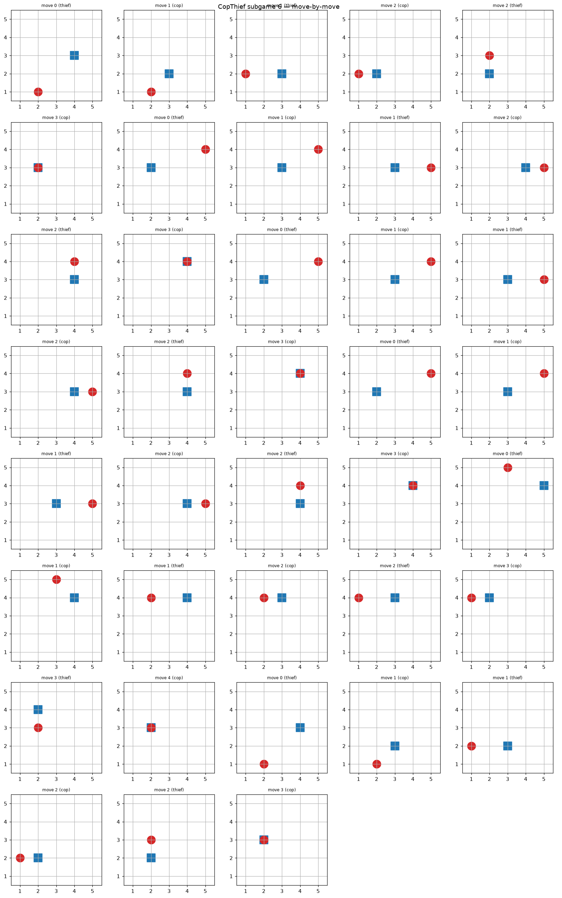

# CopThief — Dual AI Agents Pursuit Game over MCP Servers
### Exercise 6 — "Orchestration of AI Agents", University of Haifa · Dr. Yoram Segal

> A scientific write-up of the design, implementation and results. Export this file to
> PDF for the individual Moodle submission. Repository: see `README.md`.

---

## 1. Abstract

CopThief is a complete end-to-end pipeline in which two **autonomous AI agents** — a
**Cop** and a **Thief** — negotiate a protocol in **free natural language** and play a
turn-based pursuit game on a grid. Each agent runs as its own **MCP server** (FastMCP)
over HTTP; an **MCP client / orchestrator** owns the LLM, drives the dialogue, and acts
as the authoritative referee. The headline goal — per the assignment — is a *working
orchestration pipeline*; game strategy is secondary. The system runs fully locally
(Level 1), is cloud-deployable (Level 2), and supports inter-group competition (Level 3).

## 2. Formal model (DecPOMDP)

The pursuit is a **Decentralized, Partially Observable Markov Decision Process**:

\[ \langle n, S, \{A_i\}, P, R, \{\Omega_i\}, O, \gamma \rangle \]

- **n = 2** agents (cop, thief).
- **S** — board state: both players' cells and the set of barriers.
- **{Aᵢ}** — each agent's actions: one-step moves in 8 directions; the cop may instead
  place a barrier on its current cell.
- **P** — deterministic transition (a legal move updates a single position).
- **R** — the reward/score table (Section 4).
- **{Ωᵢ}, O** — partial observation: each agent observes the opponent's exact cell only
  within a `vision_radius`; beyond it, position is *inferred* from (possibly hidden or
  deceptive) free-language messages (see §4a).
- **γ** — discount factor (used by the optional Q-learning strategy).

## 3. Game rules, grid and scoring

- **Grid:** configurable (default 5×5; supports 2×2…N×N for staged sanity checks),
  origin configurable, 8-directional movement.
- **Subgame:** ≤ 25 moves, turn-based, **thief moves first**. Cop wins by landing on the
  thief's cell; thief wins by surviving 25 moves. Cop may place ≤ 5 barriers; entering a
  barrier is illegal (the thief is caught if it does).
- **Game:** 6 subgames played in sequence; results aggregated.

| Outcome | Cop | Thief |
|---------|-----|-------|
| Cop wins | 20 | 5 |
| Thief wins | 5 | 10 |

Max per team in inter-group play = 90 (3×20 + 3×10); min = 30. Bonus: higher total → 10,
lower → 7, exact tie → 5 (averaged across series).

## 4. Architecture

```
External (CLI / GUI / tests)
        │
        ▼
   CopThiefSDK (single entry point)
        │
        ▼
  Orchestrator = MCP CLIENT  ──owns──►  LLM (Claude / Ollama / API / mock)
   • builds observations, decides (strategy), verbalises (LLM)
   • authoritative referee (validates moves, detects capture)
   • writes the state-by-state audit log
        │  HTTP + Bearer token
        ├───────────────► Cop  MCP server  (FastMCP) — PURE TOOLS, no LLM
        └───────────────► Thief MCP server (FastMCP) — PURE TOOLS, no LLM
                          tools: reset, observe, move, place_barrier, note
```

**Key decision (PDF §5.2):** the **LLM lives only in the MCP client**, never inside the
servers; the servers expose pure tools. The lecture's "each agent has an LLM" is honored
by running a separate LLM *persona* per agent inside the client. HTTP transport is used
**even locally**, to prepare for the cloud step.

### Component layout (`src/copthief/`)
`domain/` (board, rules, scoring, subgame state machine) · `strategy/` (heuristic +
tabular Q-learning) · `llm/` (provider abstraction) · `agents/` (FastMCP servers +
pure-tool session) · `orchestrator/` (dialogue, negotiation, match runner, MCP client) ·
`reporting/` (JSON + Gmail) · `shared/` (config, audit logger, gatekeeper, version) ·
`gui/` · `sdk/`.

## 4a. Partial observation (vision radius)

Faithful to the DecPOMDP framing and PDF §4.5 ("observation ambiguity; initial distance
exceeds the **vision radius**"), an agent knows the opponent's exact cell **only within a
configurable Chebyshev `vision_radius`**. Beyond it, agents rely on free-text messages:
under `disclosure: partial` an agent **hides its exact cell when unseen** (it states a
move but no coordinates), so the opponent's belief goes stale and it must search and
re-acquire; once within the radius, positions are confirmed (ground truth). Optional
`deception: true` lets a hidden thief state a *false* cell — survivable only because
proximity restores ground truth. **This visibly changes outcomes:** measured cop-win rate
on 5×5 is 1.00 under full observability but **~0.31 with `vision_radius: 1` + partial**
disclosure (the thief escapes most subgames) — quantifying the partial-observation
challenge. Radius 2+ lets the cop re-acquire too easily on 5×5. (`exact` reproduces full
observability for the deterministic pipeline demo.)

**Negotiating the radius (inter-group):** because the radius strongly favours one side,
each agent advocates the value helping its role in the opening handshake — the **cop
requests a wider radius, the thief a narrower one**. An enhancement takes effect only on
**mutual agreement** (`negotiable: true`); otherwise the base radius applies, so a savvy
thief refuses the cop's wider request. Disabled in the self-game (base rules only).

## 5. Free-language communication

There is **no rigid wire protocol**. The match opens with a **negotiation handshake**:
each agent emits a free-language message agreeing on board size, origin and turn order
(logged as `negotiation` events). Thereafter, on each turn the agent's LLM verbalises its
move and current cell as `(x,y)`; a tolerant parser extracts the coordinate so the
opponent can update its belief. Role-specific system prompts (`llm/prompts.py`) shape the
cop's pursuing tone and the thief's evasive tone.

Example (real Claude run, see `assets/demo_transcript.md`):

> **thief:** "Nice try, but I'm slipping west to (2,3) and you won't pin me down."
> **cop:** "I see you out there, thief—I'm sliding west to (4,2) and closing the distance."

## 6. LLM architecture (three approaches)

1. **Cloud API key** (OpenAI / Anthropic / Gemini) — simplest, recommended.
2. **Local Ollama** exposed via a secure tunnel (ngrok / Localtonet).
3. **Hybrid** — LLM + client local, only the MCP servers public (outbound HTTPS only).

The implementation provides a `claude` provider (Claude **CLI** on the free subscription,
with an Anthropic-API fallback), an `ollama` provider, a generic cloud `api` provider, and
an offline deterministic `mock` provider used for CI. All calls route through an API
**gatekeeper** (rate limiting + retries).

## 7. Strategy (secondary)

- **Adaptive (default):** anticipates the opponent's next cell from its last observed
  move and targets that — the cop **intercepts** where the thief is heading; the thief
  **evades** the cop's projected cell — so each agent *changes its play in reaction to
  the enemy mid-game*. Reuses the cornering/mobility tie-breaks below.
- **Heuristic:** the cop minimises Chebyshev distance with a *cornering* tie-break that
  removes the thief's escape routes; the thief maximises distance with a *mobility*
  tie-break. The cop uses barriers only when *stuck* (need-based, ≤5/subgame).
- **Tabular Q-learning (optional):** ε-greedy with the Bellman update
  `Q(s,a) ← Q(s,a) + α[r + γ·maxₐ′Q(s′,a′) − Q(s,a)]`, distance-shaped rewards.
- **Strategy-expert skills:** `.claude/skills/cop-strategist` and `thief-strategist`
  document the per-role principles and mid-game adaptation cues.

## 8. Logging, reporting and security

- **Audit log** (`logs/game_audit.log`): append-only JSON-lines record of every
  negotiation message, turn, and outcome — the evidence trail for inter-group dispute
  resolution (emphasised repeatedly in the lecture).
- **Reports:** structured JSON for the internal game (§9.1) and inter-group bonus (§9.2);
  emailed via the **Gmail API** (OAuth `gmail.modify`, token-based).
- **Security:** transport-level **bearer-token** auth on every MCP call (revoke by
  rotating the token; wrong/absent token → 401). Secrets only via environment / `.env`;
  no keys in source.

## 9. Results

A full self-game (6 subgames, seed 7) with the cornering heuristic:

| Metric | Value |
|--------|-------|
| Cop total / Thief total | 120 / 30 |
| Cop capture rate (2×2…6×6, 60 trials each) | ~1.0 |
| Avg moves-to-capture | grows with board size (see notebook) |

The **staged sanity checks** prescribed by PDF §4.5 (2×2 → 3×3 → 4×4 → 5×5, increasing
observation ambiguity) are run as a board-size sweep in `notebooks/analysis.ipynb`.

**Visualisation.** Three complementary views: a **real-time ASCII board** printed every
turn during play (`copthief selfplay --verbose` / the demo capture), a final-state PNG, and
a move-by-move filmstrip — so the agents' and barriers' movement is visible live and as a
replay. Proof-of-play artifacts:




## 10. Cost analysis

Every external LLM (and Gmail) call routes through the central **API gatekeeper**
(rate-limit + retry, config-driven) and a **usage meter** (`shared/usage.py`) that
estimates input/output tokens (~4 chars/token) and USD cost from a configurable per-model
price table. After each game a `results/usage_<ts>.json` is written with the per-model
breakdown and totals. `est_usd` prices tokens at **API rates**, so it is the actual cost
when the Anthropic-API path is used and the **API-equivalent** cost (i.e. the amount saved)
when the free Claude-CLI subscription serves the call. Because messages are short (one–two
sentences) token use is minimal: at the current Opus 4.8 rate ($5/$25 per 1M in/out) one
subgame is **≈ $0.08** and a full 6-subgame game is **well under $1** on the API — and
**free** on the CLI subscription. The meter reports the exact figure per run in
`results/usage_<ts>.json`.

## 11. Quality & engineering

- **uv** package manager (mandatory); `pyproject.toml` + `uv.lock`.
- **102 tests, ~93% coverage** (`pytest --cov`); external HTTP/LLM mocked; hermetic.
- **Ruff** clean; every source file **≤ 150 lines**; SDK-layered, OOP/DRY; config-driven
  (no hardcoded game parameters); versioned config.
- **API gatekeeper**: all external LLM/Gmail calls route through one throttled, retrying,
  metered chokepoint (Template-Method `LLMProvider.complete`).
- **UI/UX (Nielsen heuristics):** the CLI/GUI favour *visibility of system status* (live
  board + turn-by-turn dialogue), *match between system and real world* (natural-language
  taunts, human (x,y) labels), *consistency* (one `copthief` command surface), and *error
  prevention/recovery* (graceful email/LLM degradation, clear logs).
- Verified from a **fresh clone** (`uv sync` + tests + run) — self-sufficient repo.

## 12. Deployment & levels

Level 1 (local self-game) ✓ working; Level 2 (cloud) — host both MCP servers and point the
client at tokenised HTTPS URLs; Level 3 (inter-group) — exchange the four URLs + tokens,
run `netplay`, both teams email matching JSON reports. See `docs/DEPLOYMENT.md`.

## 13. Known limitations & future work

- The move decision uses a heuristic (per the assignment, strategy is secondary); the
  Q-learning option is provided but not trained to optimality.
- In self-play the believed opponent position equals the true one; under partial
  observability with a real opponent, belief comes solely from parsed messages.
- Bearer auth uses a static token (sufficient for the exercise); OAuth/JWT is a future
  hardening step.

## 14. How to run

```bash
uv sync
uv run copthief selfplay --gui          # local self-game (mock by default)
# real Claude: set COPTHIEF_LLM_PROVIDER=claude in .env, then selfplay
uv run python scripts/capture_demo.py   # board + filmstrip + transcript
uv run pytest --cov                     # tests
```
